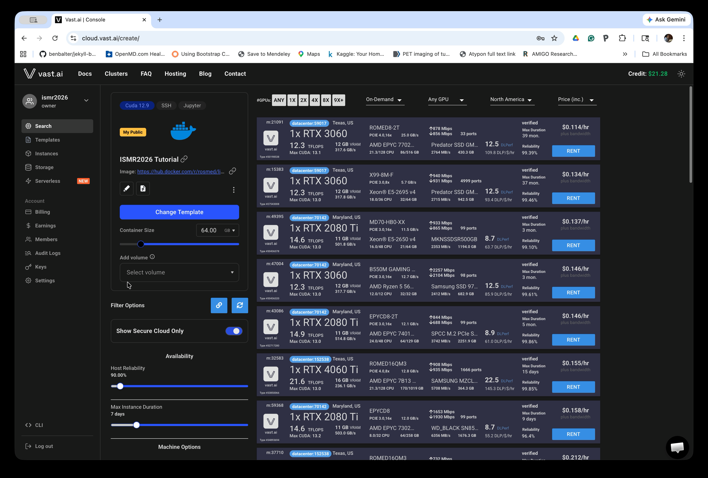
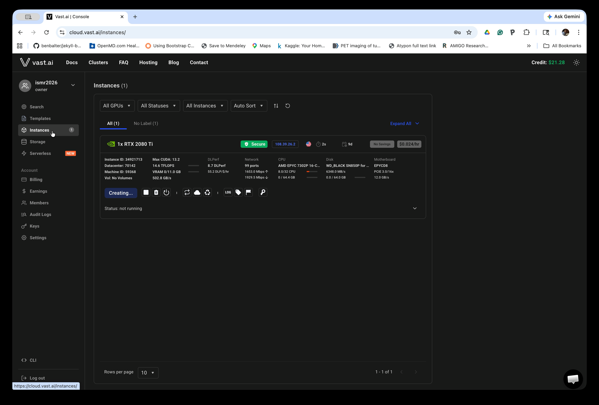

# Launching a Container on Vast.ai

For the EMBC2026 workshop, we will use Vast.ai to run the Linux desktop environment hosted on a cloud computing service and access it through a web browser. Vast.ai has a mechanism to share a Docker container among its users and deploy it on a selected GPU server. The EMBC2026 uses this mechanism to distribute a pre-built Linux environment with 3D Slicer and ROS packages required for the tutorial.

> **Before you start:** Make sure you have a Vast.ai account and have added credits. See [Prerequisites](prerequisites.html) for account setup instructions.

> **For EMBC2026 Participants:** We will add you to the 'ismr2026' team on vast.ai, which allows us to share virtual Linux environments using the workshop's credit. Please send your e-mail address with the conference organizer (lconnol8@jh.edu). 

Make sure you have a Vast.ai account and have added credits. See [Prerequisites](prerequisites.html) for account setup instructions.

> **Note:** The screenshots below still show the old "ismr2026" template and team name. The actual template and team you'll use are named "embc2026" — the steps are otherwise identical.

## Step 1: Open the EMBC2026 Tutorial Template

Click the following link to open the tutorial template in the Vast.ai Console:
[EMBC 2026 Workshop v2](hhttps://cloud.vast.ai?ref_id=424992&template_id=56a83a573a004facc87da03e871b0784).

Alternatively, log in to Vast.ai, navigate to **Templates** in the left sidebar, and find the **EMBC2026 Tutorial** template.

## Step 2: Select a Machine and Rent

After opening the template link, the Console search page will load with the EMBC2026 Tutorial template already selected in the left panel. The main area lists available GPU machines with their specs and hourly prices.

Increase **Container Size** under the **Change Template** button to 64GB. Choose a machine near your location with a reasonable price. Click the **RENT** button next to your chosen machine to launch an instance.

> **For better experience:** A machine with higher network bandwidth can save time for starting up the container. We recommend to turn the "Show Secure Cloud Only" option to limit the list to machines in datacenters.  

## Step 3: Wait for the Instance to Start

After clicking RENT, you will be taken to the **Instances** page. Your new instance will appear with a **Creating...** button while the container is being set up. 

This process typically takes a few minutes to hours, depending on the machine you chose. You can refresh the page to check progress.

> **To save time:** You can rent multiple machines initially, and use the one which becomes available first. You can destroy the rest. 

## Step 4: Open the Instance

Once the container is ready, the button changes from **Creating...** to **Open**, and the status will show the container is running.

Click the **Open** button. 

> **If you don't see a new browser window:** Make sure your browser allows pop-up windows, as the Instance Portal will open in a new window.

## Step 5: Launch the Desktop Application

The Instance Portal opens in a new browser tab and shows the available applications. You will see options including:

- **Selkies Low Latency Desktop** — recommended; uses WebRTC for better performance
- **Apache Guacamole Desktop (VNC)** — fallback option if Selkies does not work

Click **Launch Application** under **Selkies Low Latency Desktop**. If Selkies does not connect, try **Apache Guacamole Desktop (VNC)** instead.

## Step 6: Wait for Selkies to Load

Selkies opens in a new browser tab and begins loading. The screen will appear black with a loading animation while the desktop environment initializes. This may take up to a minute.

## Step 7: Start the Desktop Session

Once loading completes, a **START** button appears in the center of the screen. Click it to connect to the Linux desktop.

## Step 8: Use the Linux Desktop

The Linux desktop environment is now running in your browser. You can interact with it just like a local desktop. The taskbar is at the bottom of the screen.

You are now ready to proceed with the tutorial.

> **Important:** Remember to **destroy your instance** when you are done to avoid ongoing charges. On the Instances page, click the trash can icon to destroy the instance. Simply stopping the instance will still incur storage charges.

<a href="index.html" class="btn-secondary">Back to Workshop Page</a><a href="tutorial_part1.html" class="btn-primary">Go to Next Step →</a>

