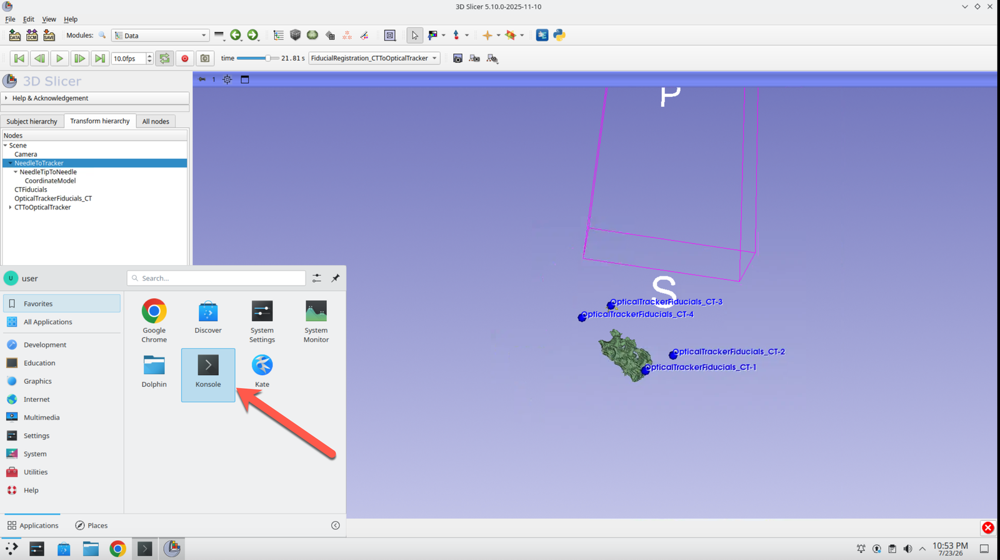
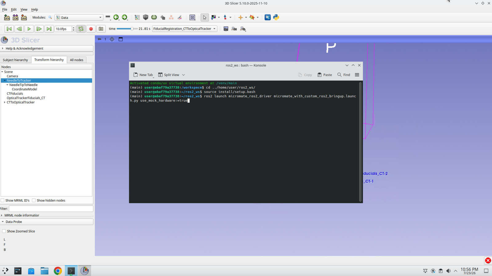
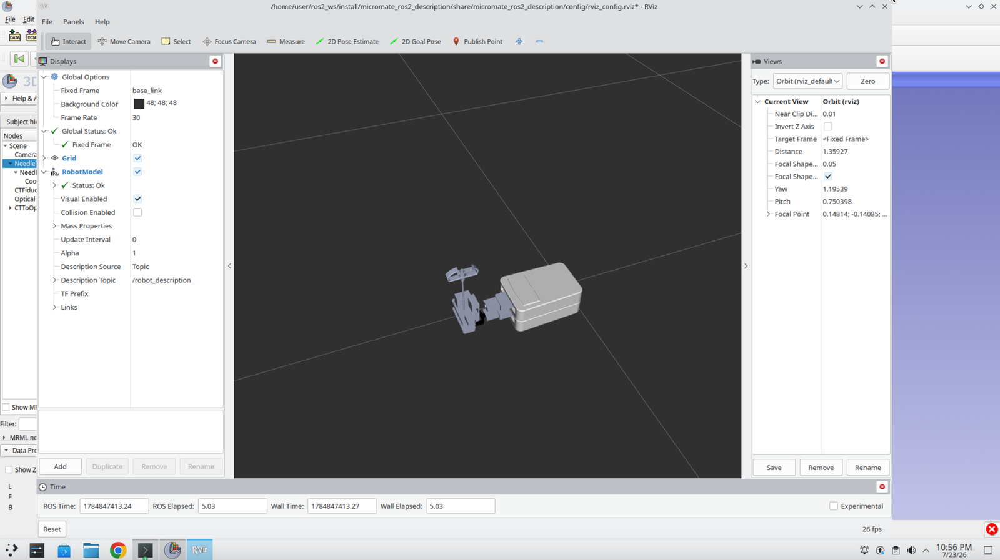
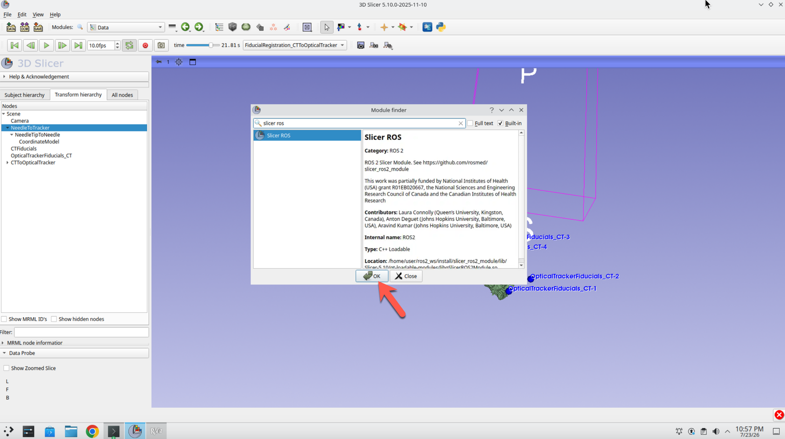
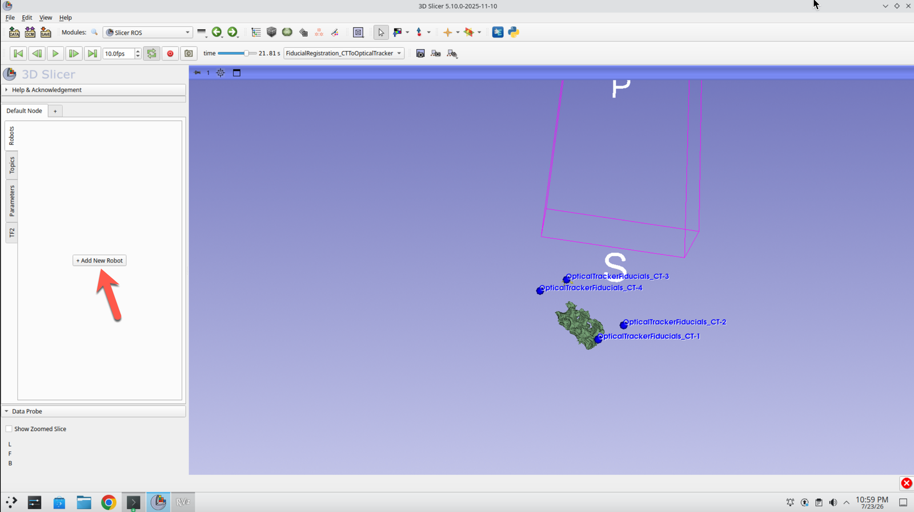
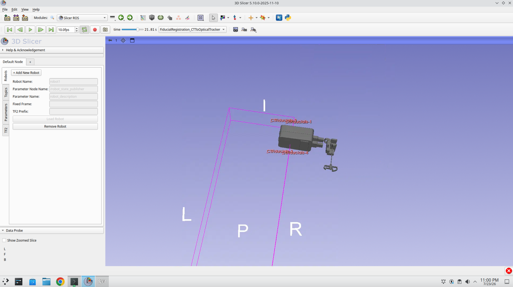
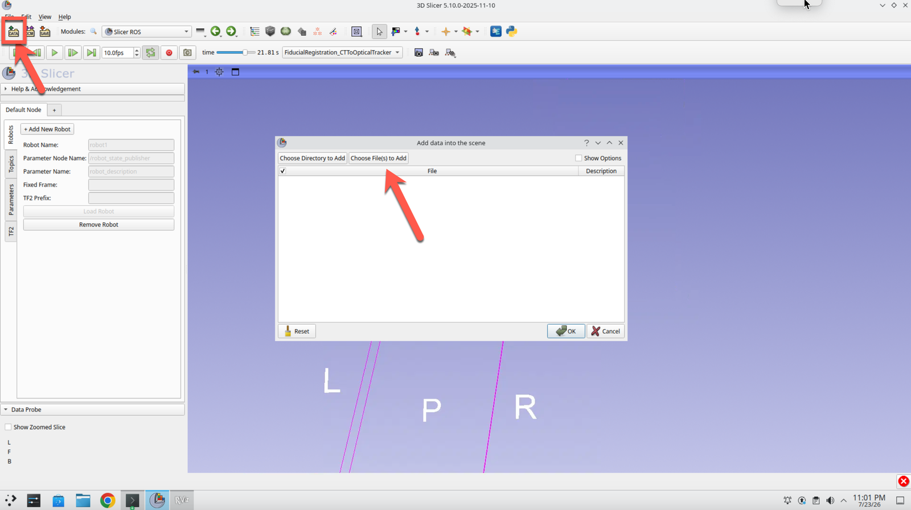
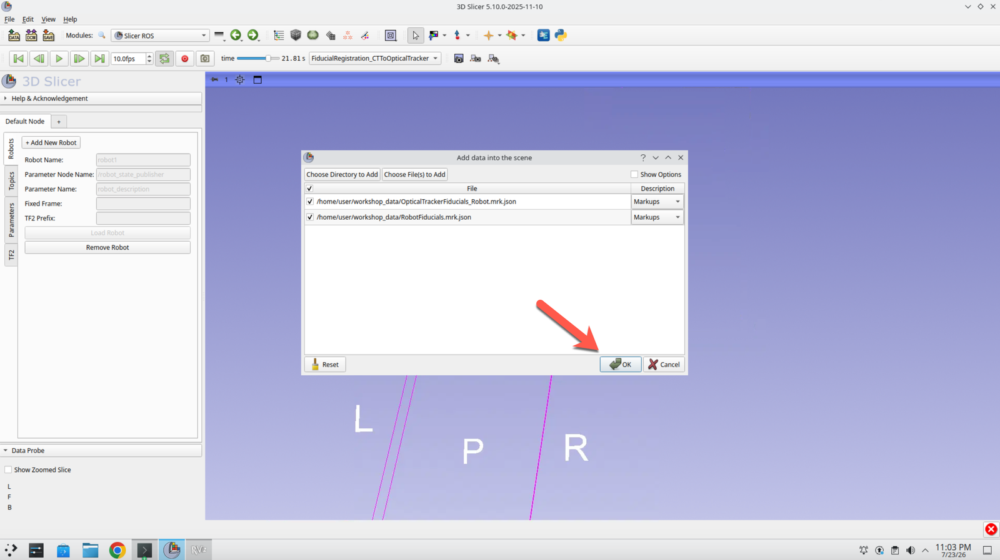
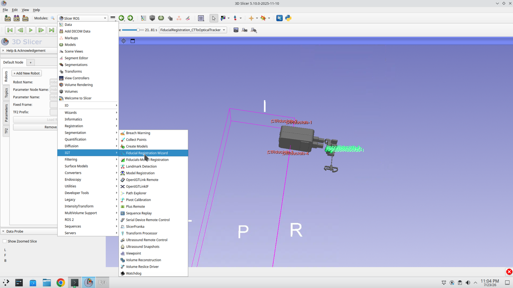
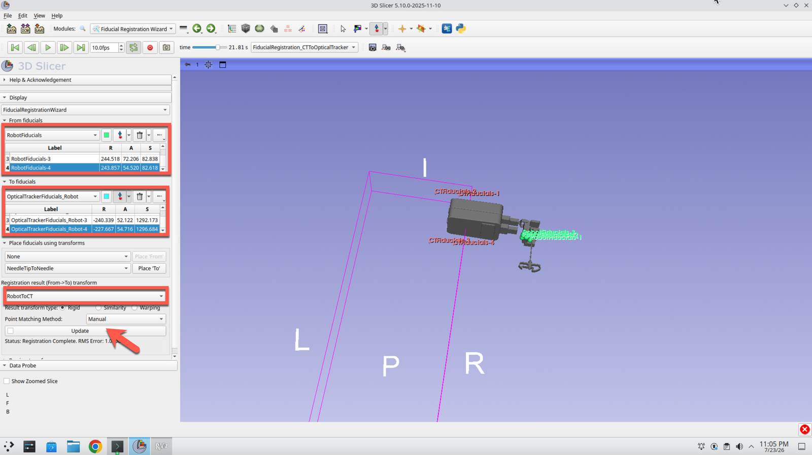

# Tutorial Part 2: Robot registration to the patient / phantom

## Overview

In this portion of the tutorial, participants will learn how to register a robot to a phantom of patient anatomy.

**Prerequisites:** Complete [Tutorial Part 1](tutorial_part1.html) first — this part continues from the navigation-ready scene built there, with 3D Slicer still running and the patient anatomy already registered to the optical tracker.

---

## Part 4: Load the Micromate Robot

### Step 44: Open a New Console

Open a new Konsole terminal, leaving Slicer running.



### Step 45: Launch the Micromate Driver

Type the following three commands to source the workspace and bring up the Micromate driver with mock hardware:

```
cd ../home/user/ros2_ws/
source install/setup.bash
ros2 launch micromate_ros2_driver micromate_with_custom_ros2_bringup.launch.py use_mock_hardware:=true
```



### Step 46: Confirm the Driver Starts

Wait for the launch output to settle. You should see the driver's node and controller startup messages.



### Step 47: Open the SlicerROS2 Module

Switch back to Slicer, press **Ctrl+F** to open the Module Finder, and search for **Slicer ROS**. Select the ROS2 module and click **OK**.



### Step 48: Add a New Robot

In the ROS2 module panel, select **+ Add New Robot** to connect Slicer to the robot description published by the driver.



### Step 49: Find the Robot in the 3D View

The Micromate model is now in the scene. You may have to navigate around in the 3D view to find it.



### Step 50: Open the Data Module

Press the **Data** button in the top left.



### Step 51: Load the Robot Fiducials

Select the two **.json** files in the workshop data folder and press **OK**. These contain the robot-frame and tracker-frame fiducial positions used for the robot registration.



### Step 52: Return to the Fiducial Registration Wizard

Go back to the **Fiducial Registration Wizard** tab.



### Step 53: Register the Robot

Select **Robot Fiducials** as the *From* list and **OpticalTrackerFiducials_Robot** as the *To* list, create a new transform called **RobotToCT**, and press **Update**.



---

## Part 5: Visualize the Registered Robot

### Step 54: Attach the Robot to the Registration Transform

Drag the robot onto the **RobotToOpticalTracker** transform. The robot model now sits in the same coordinate frame as the registered patient anatomy, completing the navigation-ready scene.

<video controls muted playsinline width="100%" poster="images/embc_54_drag_robot_to_transform_poster.png">
  <source src="images/video5.mp4" type="video/mp4">
  Your browser does not support the video tag.
</video>

### Step 55: Preview the Motion Control Module

With the scene assembled, the **ROS2 Motion Control** module can be used to plan and command robot motions relative to the registered anatomy.

<video controls muted playsinline width="100%" poster="images/embc_55_motion_control_preview_poster.png">
  <source src="images/video6.mp4" type="video/mp4">
  Your browser does not support the video tag.
</video>

---

# Summary

In this session, you:

- Launched 3D Slicer with the SlicerROS2 module from a ROS 2 workspace
- Loaded a CT image of a spine phantom and segmented the bone using Grow from Seeds
- Pivot-calibrated a tracked needle to produce a `NeedleTipToNeedle` transform
- Collected four fiducial points on the gel block and computed a `CTToOpticalTracker` registration
- Applied that registration to the CT image and segmentation to place the patient in tracker space
- Launched the Micromate driver and loaded the robot into Slicer through SlicerROS2
- Registered the robot to the patient using the Fiducial Registration Wizard
- Visualized the fully registered robot and anatomy in a single navigation-ready scene

[Back to Workshop Page](https://rosmed.github.io/ismr2026/index.html)

<div class="tutorial-nav"><a href="tutorial_part1.md" class="btn-secondary">Back to Part 1</a><a href="tutorial_part3.md" class="btn-primary">Go to Next Step →</a></div>
