Visualizing your simulation data in 3D Slicer
---------------------

Source ros and the workspace in the terminal and then launch 3D Slicer:
~~~~
source /opt/ros/humble/setup.bash
source ~/ismr24_ws/install/setup.bash
./start-slicer-ros.bash
~~~~

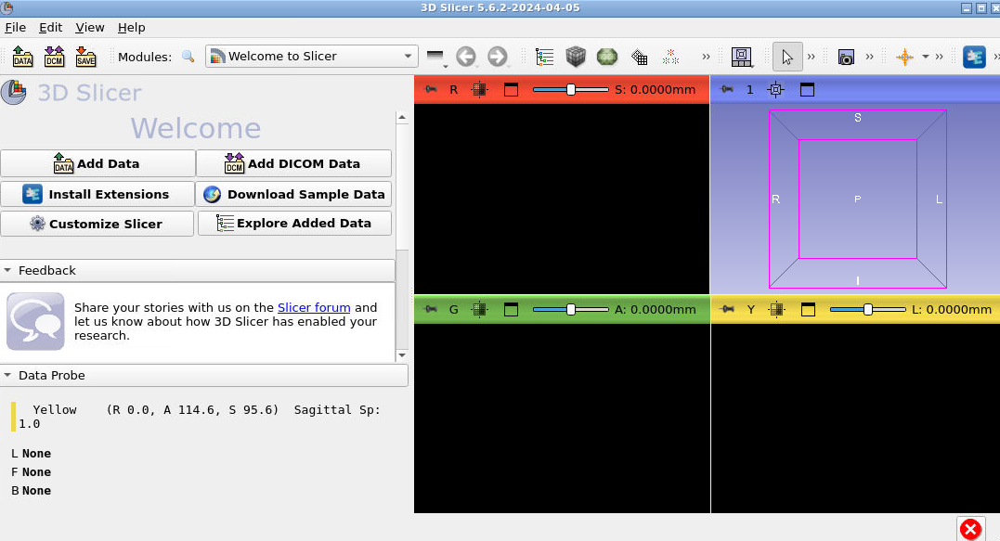{:class="img-responsive" width="800px"}

Type CTRL+F to open the module selector and search for ROS2. Select "Switch to Module" once you have selected "ROS2".

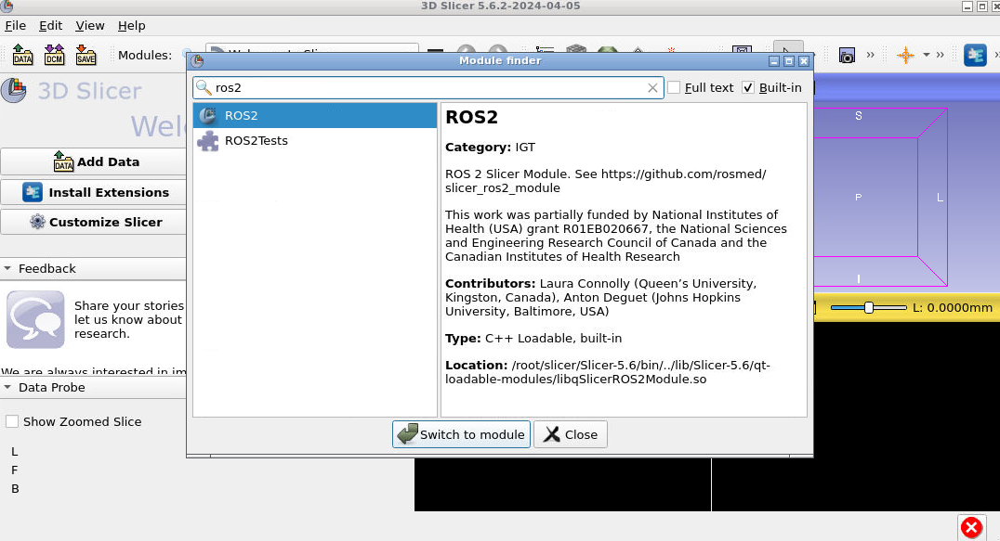{:class="img-responsive" width="800px"}

In the ROS2 module, press "Add new robot" to open the robot loading panel. Ensure the following settings are entered:

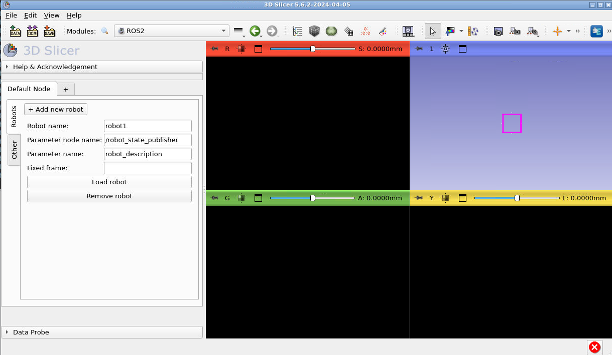{:class="img-responsive" width="800px"}

Press "Load robot" and you should see the following: 

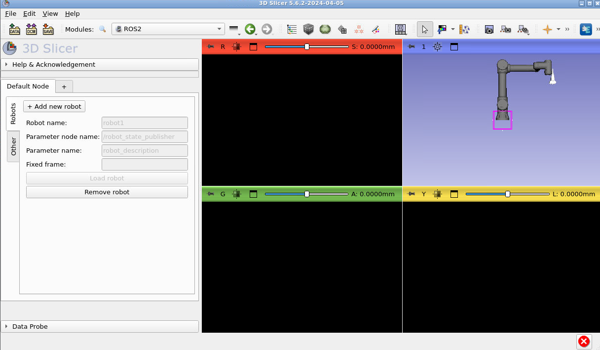{:class="img-responsive" width="800px"}

Congrats your robot is in Slicer! Now let's load the ultrasound data. Open the python console by pressing the snake icon in the top right corner of Slicer:

**Note that the next few screenshots don't have a robot in the scene but yours should still be there!**

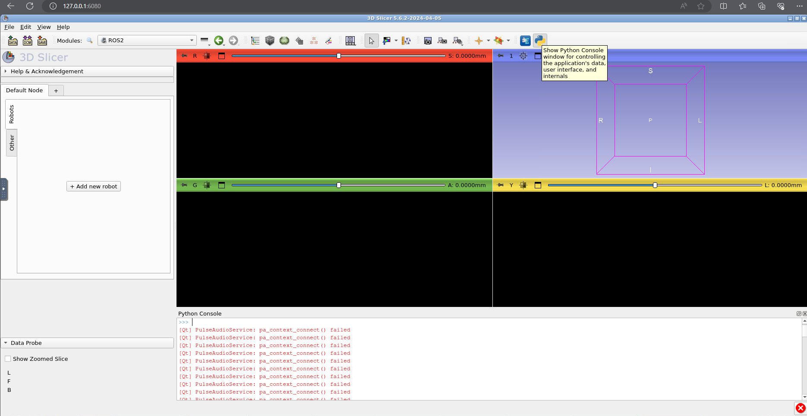{:class="img-responsive" width="800px"}

Copy and paste the following code into the python console:
~~~~
from vtk.util import numpy_support
ros2 = slicer.util.getModuleLogic('ROS2')
node = ros2.GetDefaultROS2Node()
sub = node.CreateAndAddSubscriberNode('vtkMRMLROS2SubscriberUInt8ImageNode', '/image_raw')
new_volume = slicer.mrmlScene.AddNewNodeByClass('vtkMRMLScalarVolumeNode')

def callback_function(caller, event):
  x = sub.GetLastMessage()
  numpyArray = numpy_support.vtk_to_numpy(x)
  numpyArray = numpyArray.reshape((800, 1200, 1))
  vol = slicer.util.updateVolumeFromArray(new_volume, numpyArray)

sub.AddObserver('ModifiedEvent', callback_function)
~~~~

Explanation of the code: 

The first 5 lines access the SlicerROS2 logic and create a new subscriber to the US data from Gazebo and a new volume node in 3D Slicer. The function "callback_function" and observer assignment is used to trigger a callback whenever the subscriber receives new data. Inside this function, the volume node in Slicer is updated with the new data.

Now, in the bottom right (yellow) slice viewer, press the push pin icon (top left) and change the selected volume to "Volume":

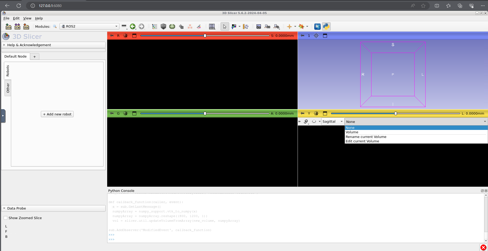{:class="img-responsive" width="800px"}

Now press the cross hair button (to the right of the push pin) and you should see a simulated ultrasound image. 

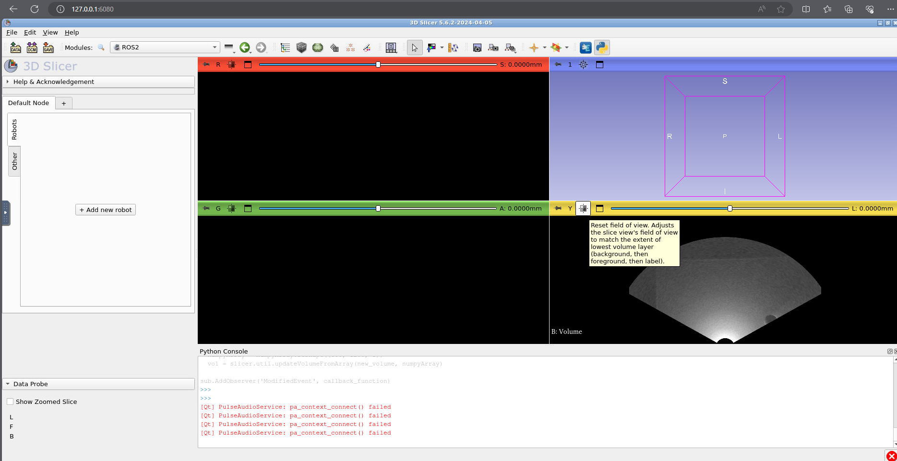{:class="img-responsive" width="800px"}

Finally, here's how you can show your ultrasound data in the correct location. Press the module selector and go to the "Transforms" module:

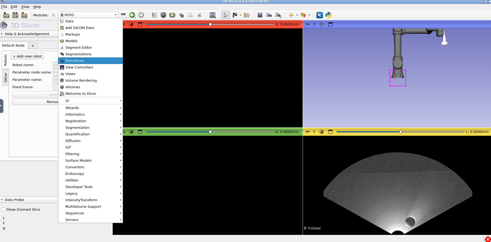{:class="img-responsive" width="800px"}

Under the "Active transform" selector, press "Create new linear transform as.." and type "US_transform".

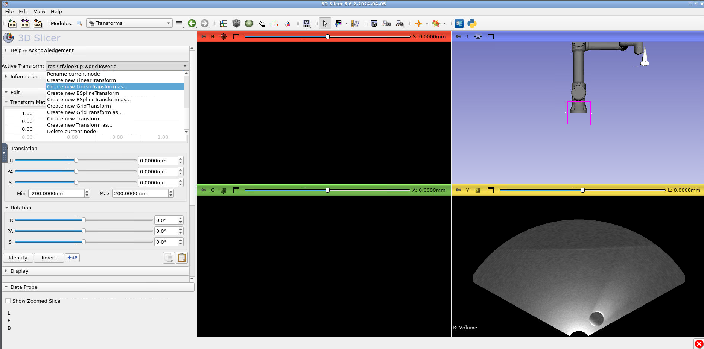{:class="img-responsive" width="800px"}

Press "Ok":

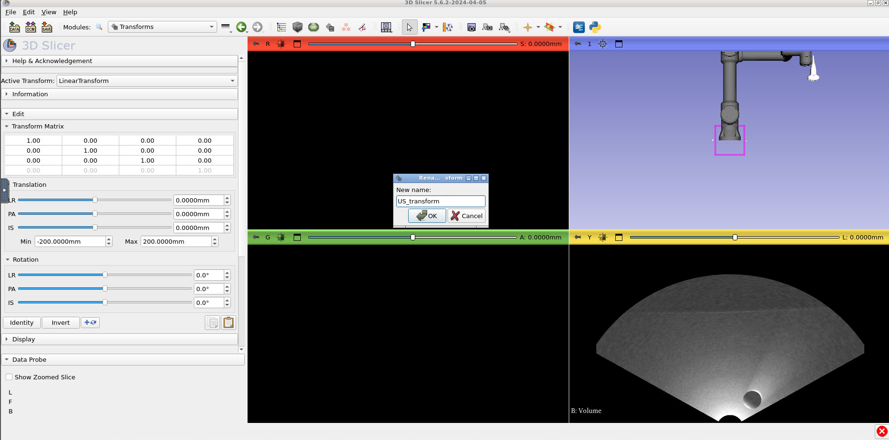{:class="img-responsive" width="800px"}

Now edit the transform to look like the following screenshot. **Tip: You can edit the transform values by double clicking on the matrix cells**: 

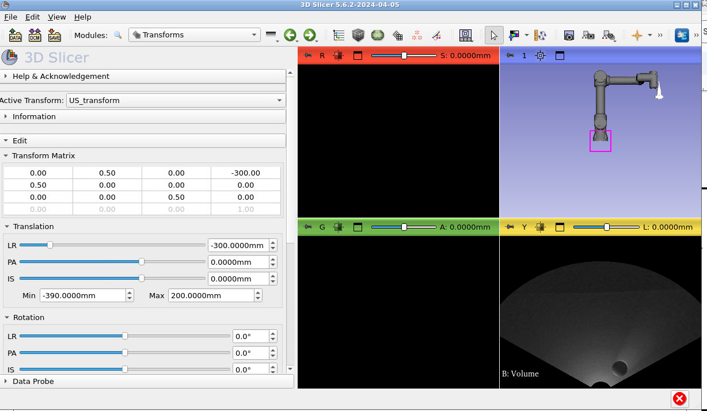{:class="img-responsive" width="800px"}

Now switch to the "Data" module:

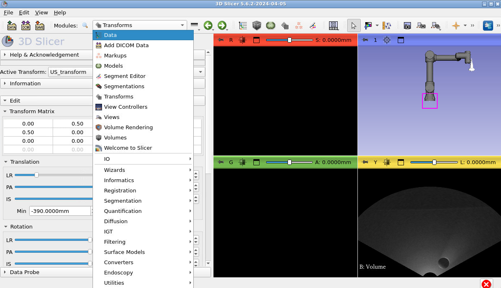{:class="img-responsive" width="800px"}

Press the little arrows beside each of the transforms to extend the entire transform tree. Once you have, you'll need to drag "US_transform" onto the "tool0Toprobe_link" lookup and "Volume" onto "US_transform". To do this dragging
click the name of the transform you want to move, press you mouse down and drag onto the one you want to observe. Someone in the workshop will demonstrate this. This is what your final tree should look like: 

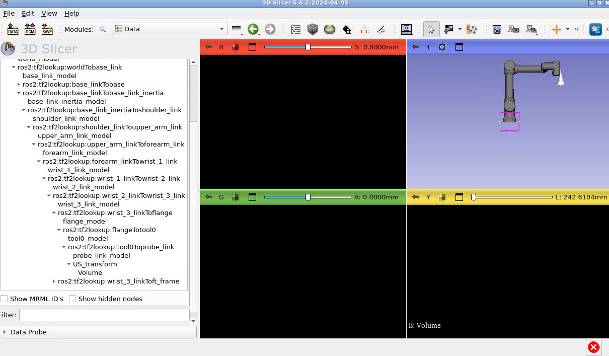{:class="img-responsive" width="800px"}

Notice how the US image is no longer visible. Let's fix that. Type CTRL + F and search for the module "Volume Reslice Driver".

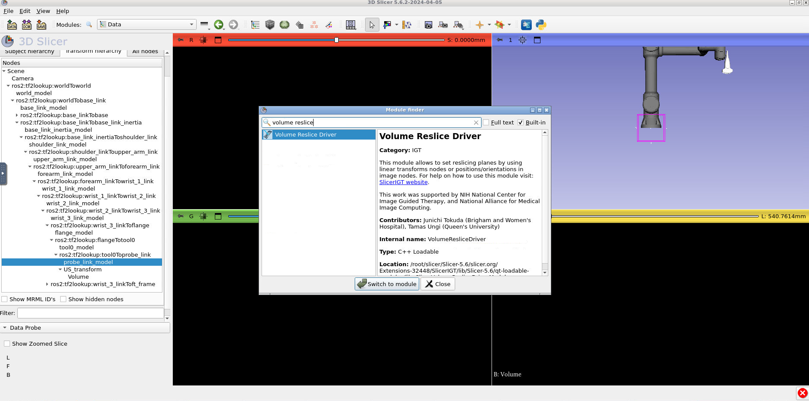{:class="img-responsive" width="800px"}

In volume reslice driver, change the yellow tab settings to the following. The "Driver:" should be "US_transform" and the "Mode" should be "Inplane":

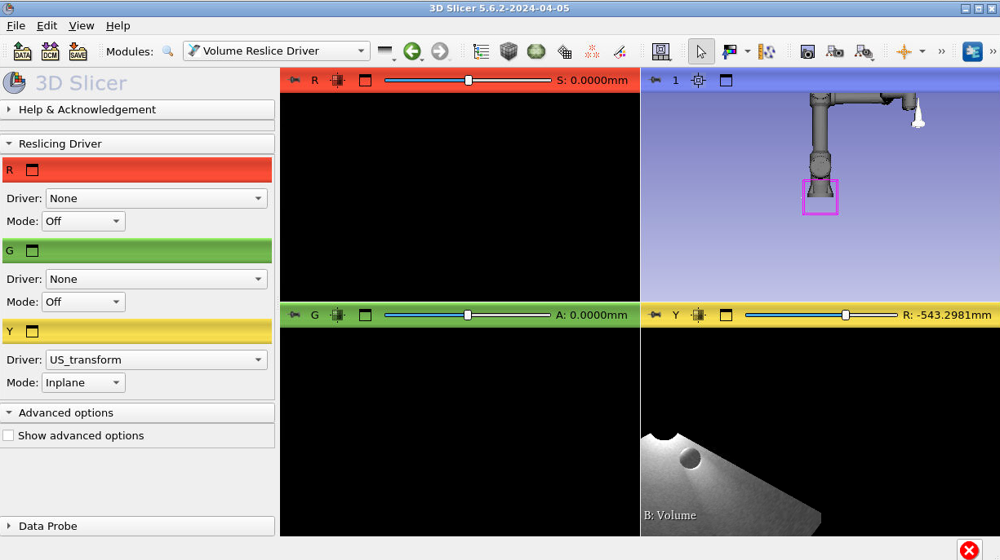{:class="img-responsive" width="800px"}

In the bottom right slice view (where you can see part of the US image) hold down shift and drag the image into the center of view.  

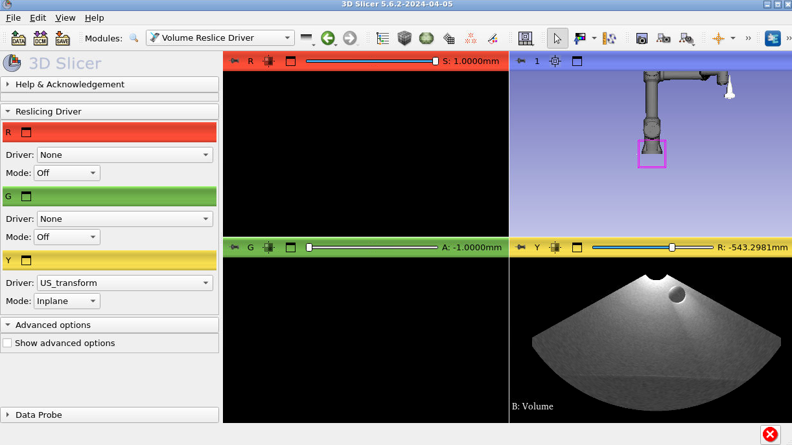{:class="img-responsive" width="800px"}

Finally, press the push pin in the yellow viewer again and press the closed eye icon to toggle it to Open. You should see the ultrasound in the 3D viewer at the end of the US probe:

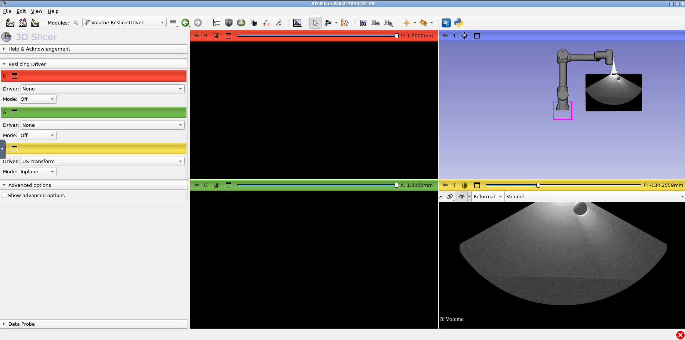{:class="img-responsive" width="800px"}

Now you can simulate US data in gazebo and visualize that data in 3D Slicer!
