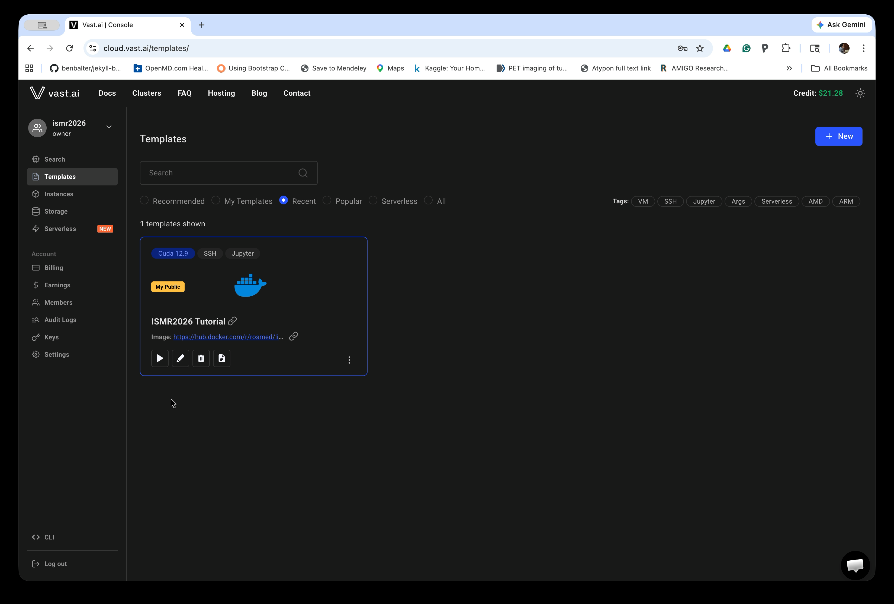
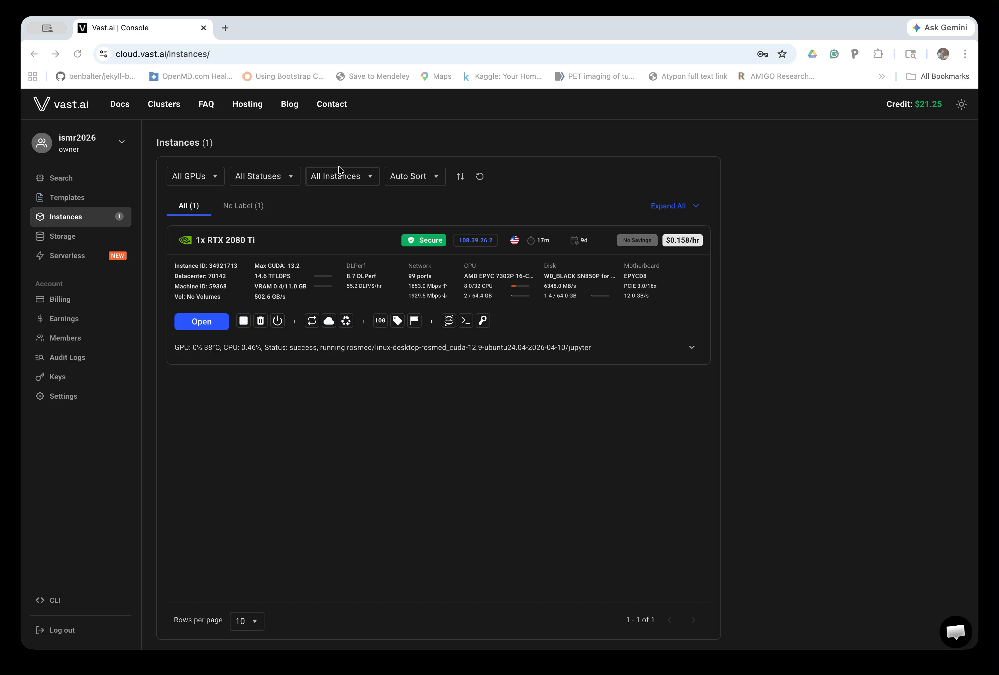
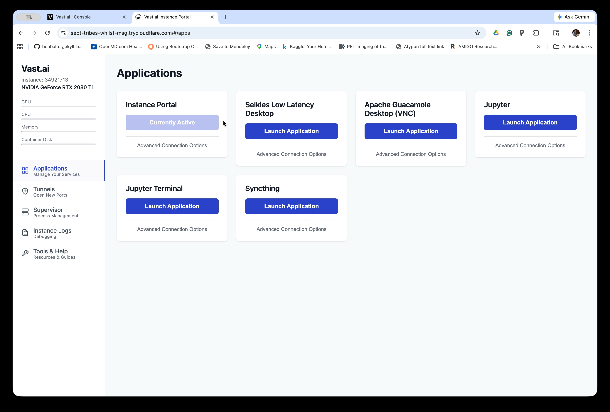
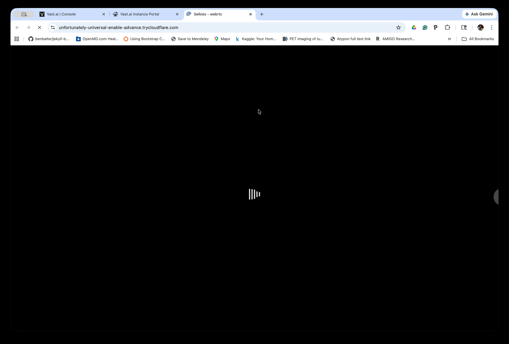
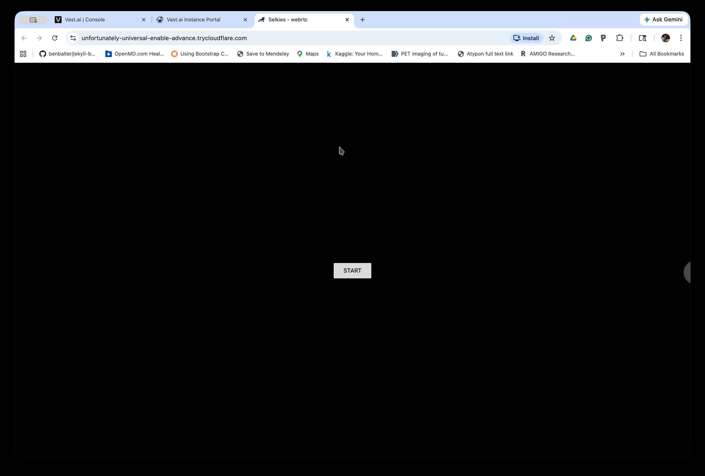
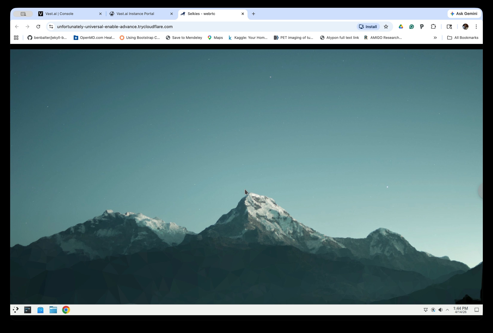

# Launching a Container on Vast.ai

For the ISMR2026 workshop, we will use Vast.ai to run the Linux desktop environment hosted on a cloud computing service and access it through a web browser. Vast.ai has a mechanism to share a Docker container among its users and deploy it on a selected GPU server. The ISMR2026 uses this mechanism to distribute a pre-built Linux environment with 3D Slicer and ROS packages required for the tutorial.

> **Before you start:** Make sure you have a Vast.ai account and have added credits. See [Prerequisites](prerequisites.html) for account setup instructions.

## Step 1: Open the ISMR2026 Tutorial Template

Click the following link to open the tutorial template in the Vast.ai Console:
[ISMR2026 Tutorial Template](https://cloud.vast.ai?ref_id=424992&template_id=6072a53b0c32f0ac80aebee5462852ad)

Alternatively, log in to Vast.ai, navigate to **Templates** in the left sidebar, and find the **ISMR2026 Tutorial** template. It is tagged with Cuda 12.9, SSH, and Jupyter.

## Step 2: Select a Machine and Rent

After opening the template link, the Console search page will load with the ISMR2026 Tutorial template already selected in the left panel. The main area lists available GPU machines with their specs and hourly prices.

Choose a machine near your location with a reasonable price. Click the **RENT** button next to your chosen machine to launch an instance.

## Step 3: Wait for the Instance to Start

After clicking RENT, you will be taken to the **Instances** page. Your new instance will appear with a **Creating...** button while the container is being set up. The status bar at the bottom will show "Status: not running."

This process typically takes a few minutes. You can refresh the page to check progress.

## Step 4: Open the Instance

Once the container is ready, the button changes from **Creating...** to **Open**, and the status will show the container is running.

Click the **Open** button. Make sure your browser allows pop-up windows, as the Instance Portal will open in a new window.

## Step 5: Launch the Desktop Application

The Instance Portal opens in a new browser tab and shows the available applications. You will see options including:

- **Selkies Low Latency Desktop** — recommended; uses WebRTC for better performance
- **Apache Guacamole Desktop (VNC)** — fallback option if Selkies does not work

Click **Launch Application** under **Selkies Low Latency Desktop**. If Selkies does not connect, try **Apache Guacamole Desktop (VNC)** instead.

## Step 6: Wait for Selkies to Load

Selkies opens in a new browser tab and begins loading. The screen will appear black with a loading animation while the desktop environment initializes. This may take up to a minute.

## Step 7: Start the Desktop Session

Once loading completes, a **START** button appears in the center of the screen. Click it to connect to the Linux desktop.

## Step 8: Use the Linux Desktop

The Linux desktop environment is now running in your browser. You can interact with it just like a local desktop. The taskbar is at the bottom of the screen.

You are now ready to proceed with the tutorial.

> **Important:** Remember to **destroy your instance** when you are done to avoid ongoing charges. On the Instances page, click the trash can icon to destroy the instance. Simply stopping the instance will still incur storage charges.

[Back to Prerequisites](prerequisites.html) | [Back to Workshop page](index.html)
