# Overview

In this interactive session, you will launch a simulated Universal Robots UR5 arm with MoveIt motion planning, connect it to 3D Slicer through the SlicerROS2 module, load patient anatomy and a custom end-effector into the scene, and plan trajectories that interact with the anatomical models using the new ROS2 Motion Control module. 
**Prerequisites:** Complete the environment setup in the [Prerequisites](prerequisites.html) page and launch a vast.ai container as described in [Launching a Container on Vast.ai](container.html). All commands below are run inside Konsole terminals in the vast.ai desktop environment.

---

## Part 1: Launch the Universal Robot Example

### Step 1: Open a Konsole Terminal

From the vast.ai desktop, open the applications menu and launch **Konsole**.

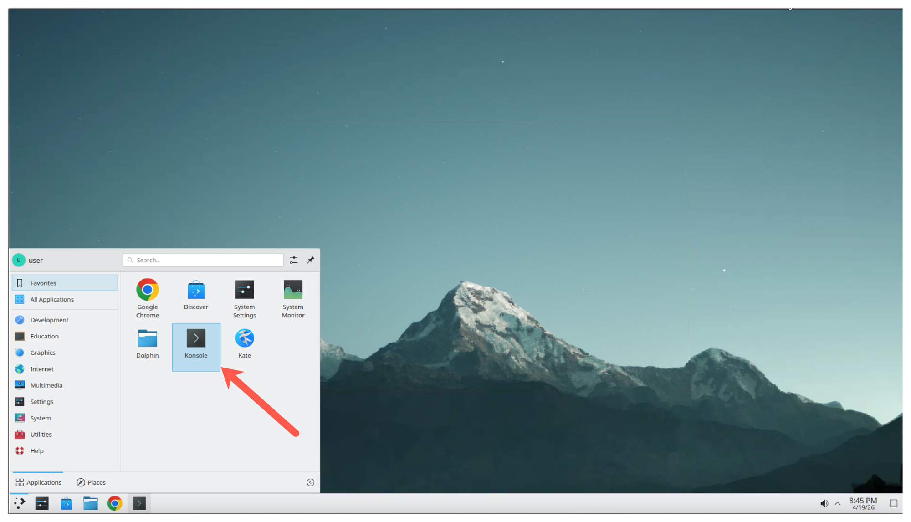

### Step 2: Launch the UR Robot Driver

In the Konsole terminal, run the UR robot driver with mock hardware enabled. This starts the controller stack for a simulated UR5 without requiring a physical robot:

```bash
ros2 launch ur_robot_driver ur_control.launch.py \
    ur_type:=ur5 \
    robot_ip:=192.168.56.101 \
    use_mock_hardware:=true \
    launch_rviz:=false
```

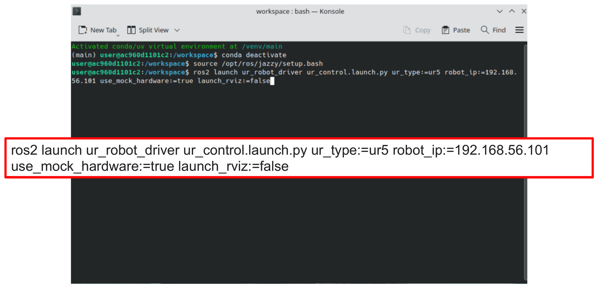

Wait for the controller manager to finish loading. You should see log output indicating that the `passthrough_trajectory_controller`, `freedrive_mode_controller`, and `tool_contact_controller` have been loaded and configured.

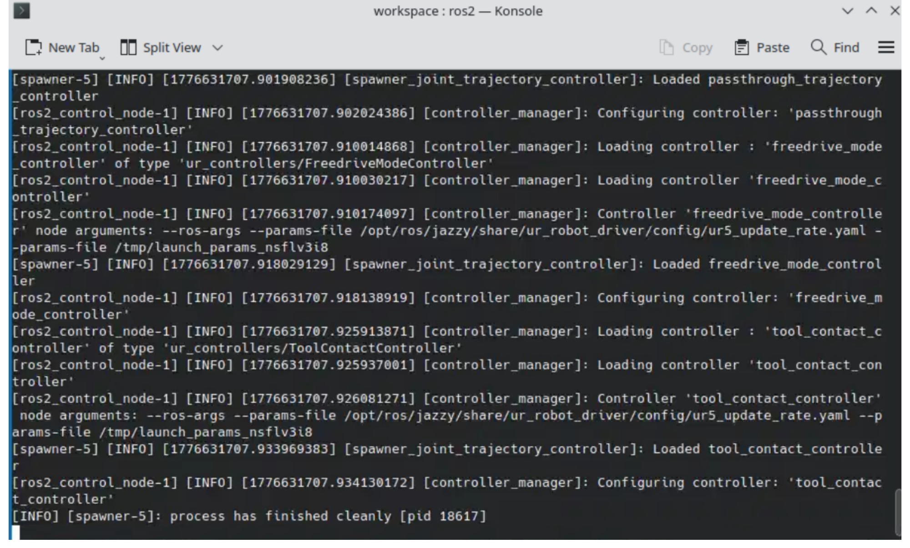

### Step 3: Launch MoveIt in a Second Terminal

Open a second Konsole terminal and launch the MoveIt configuration for the UR5:

```bash
ros2 launch ur_moveit_config ur_moveit.launch.py \
    ur_type:=ur5 \
    use_mock_hardware:=true
```

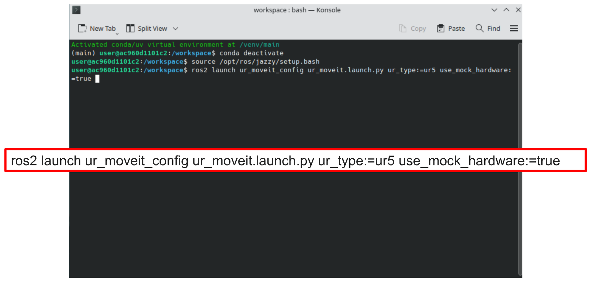

### Step 4: Confirm the RViz MoveIt Viewer Opens

The MoveIt launch brings up an RViz window with the MoveIt MotionPlanning panel. You should see the UR5 robot model rendered in the 3D view with the MotionPlanning controls on the left.

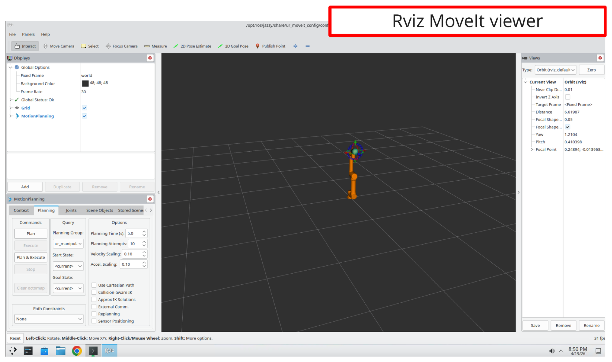

### Step 5: Locate the MotionPlanning Panel

The lower-left portion of the RViz window contains the MotionPlanning panel, with tabs for Context, Planning, Joints, Scene Objects, and others. This is where you will configure the planner in the next step.

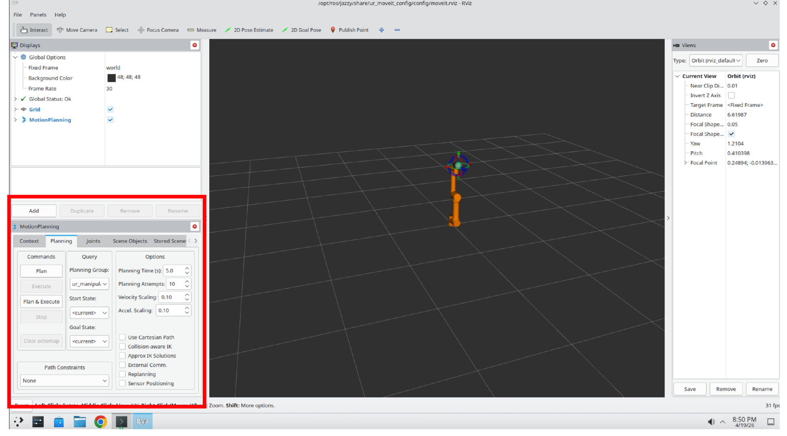

### Step 6: Select the CHOMP Planning Library

Switch to the **Context** tab of the MotionPlanning panel. In the **Planning Library** dropdown, change the selection from `ompl` to `chomp`. The label at the top of the panel will update from OMPL to CHOMP once the change is applied.

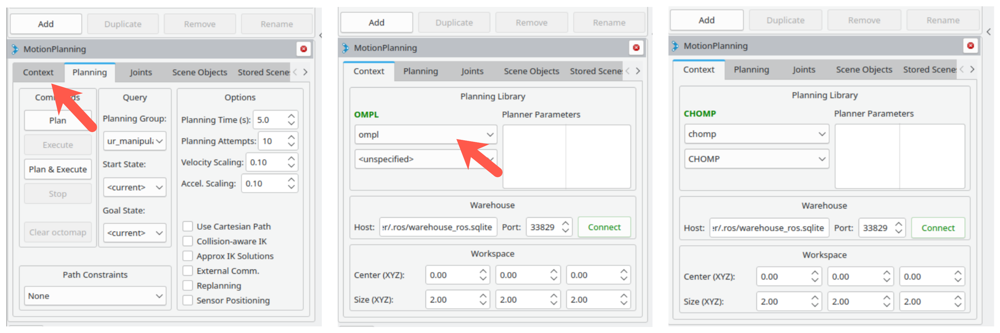

---

## Part 2: Launch SlicerROS2

### Step 7: Start 3D Slicer with SlicerROS2

Open a third Konsole terminal and launch Slicer with the SlicerROS2 module. The commands below deactivate the default conda environment, switch to the ROS 2 workspace, source the overlays, and start Slicer:

```bash
conda deactivate
cd ../home/user/ros2_ws/
source /opt/ros/jazzy/setup.bash
source install/setup.bash
ros2 launch slicer_ros2_module slicer.launch.py
```

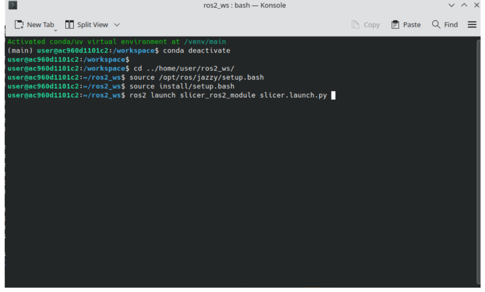

### Step 8: Confirm Slicer Launches

After a short load time, the 3D Slicer welcome screen appears with an empty 3D view.

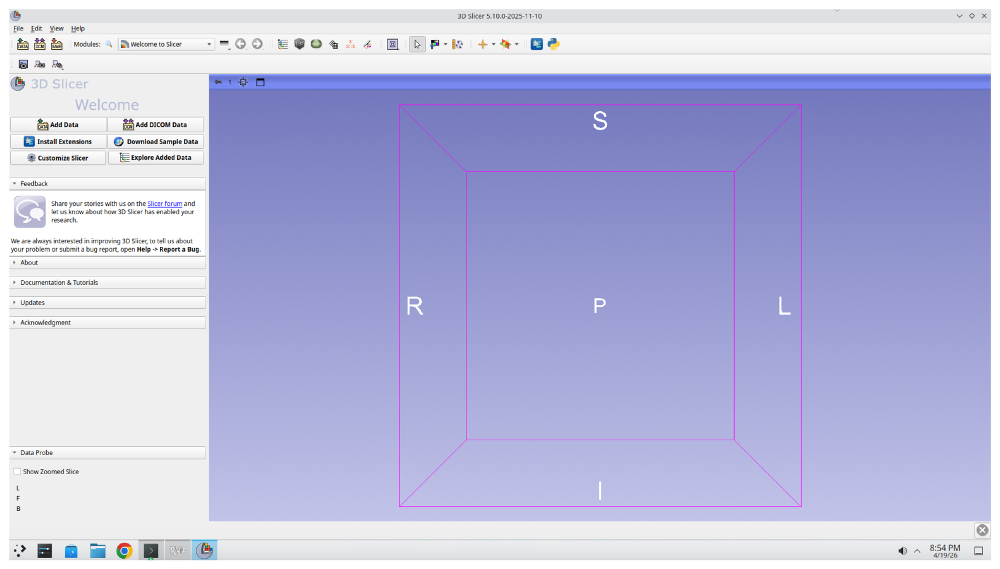

### Step 9: Open the SlicerROS2 Module

Press **Ctrl+F** to open the Module Finder, then type `ROS2` into the search box. Select **ROS2** from the results and click **OK**.

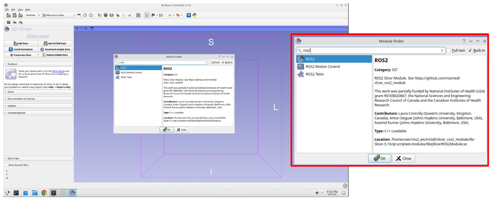

---

## Part 3: Load the Robot into Slicer

### Step 10: Add a New Robot

In the ROS2 module panel, click **+ Add new robot**. A configuration form appears with fields for the robot name, parameter node name, parameter name, fixed frame, and Tf2 prefix.

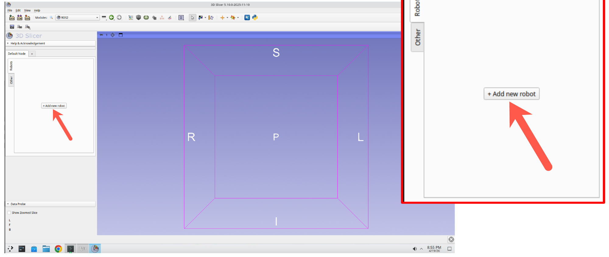

### Step 11: Load the Robot

The default values (`robot1`, `/robot_state_publisher`, `robot_description`) match the running UR5 driver from Part 1. Click **Load robot** to connect Slicer to the robot description being published by ROS 2.

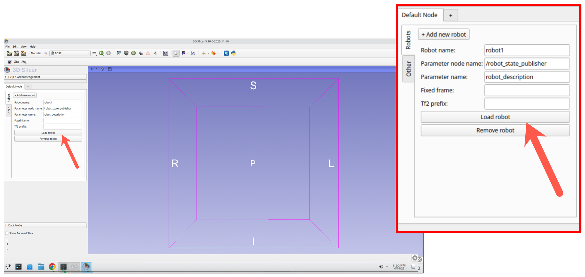

### Step 12: Confirm the Robot Appears in the 3D View

The UR5 model is rendered in the Slicer 3D view. You should see the robot's base and first links positioned at the world origin.

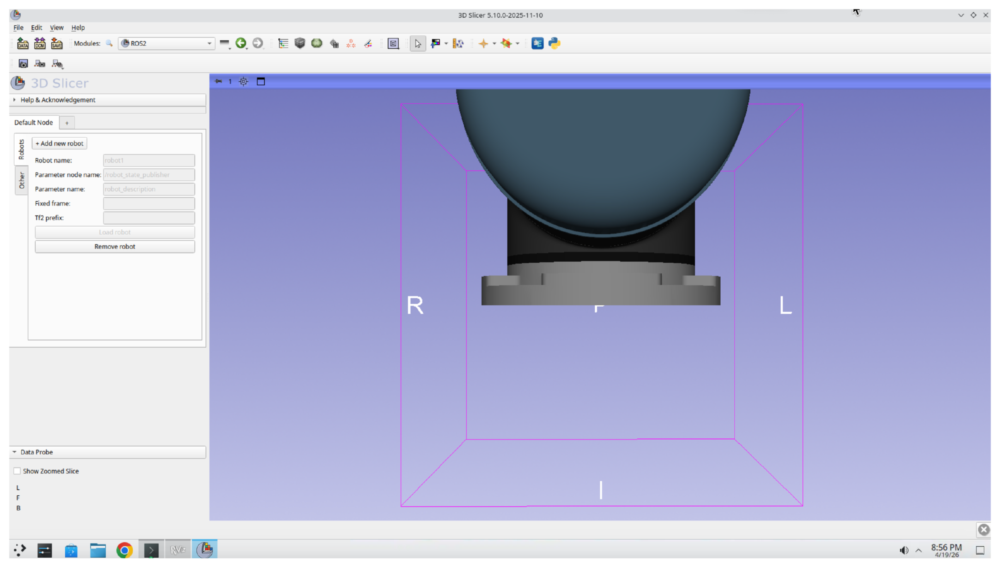

---

## Part 4: Switch to the ROS2 Motion Control Module

### Step 13: Open the ROS2 Motion Control Module

Press **Ctrl+F** again and search for `ROS2 Motion`. Select **ROS2 Motion Control** from the results and click **OK**.

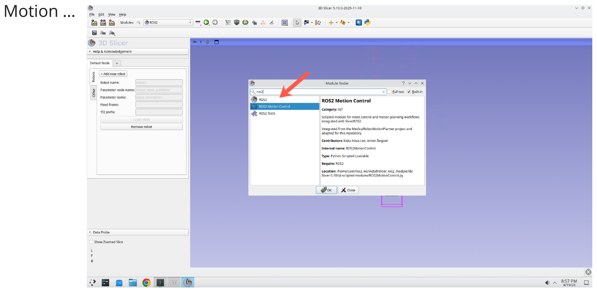

### Step 14: Select the Robot and Press Use

In the Motion Control module, make sure `ros2:robot:robot1` is selected in the **Robot Name** dropdown, then click **Use** to bind the module to the loaded robot.

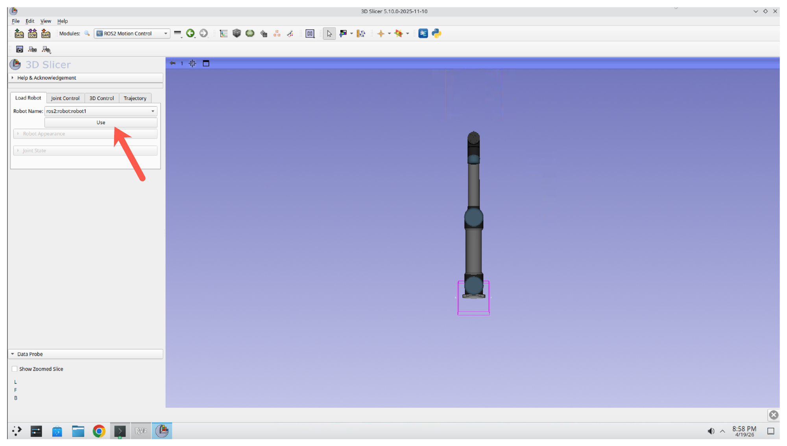

### Step 15: Confirm the Full Robot Renders

Once bound, the full UR5 arm is rendered in Slicer with all joints and links visible.

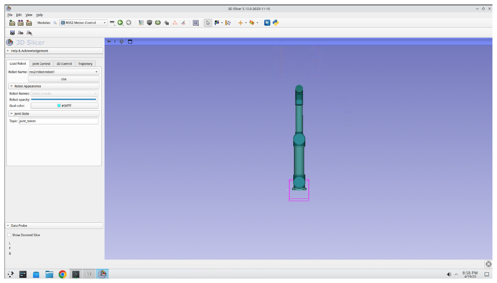

### Step 16: Explore the Motion Control Tabs

Explore each of the tabs in the Motion Control panel: **Load Robot**, **Joint Control**, **3D Control**, and **Trajectory**. Each tab exposes a different interaction mode with the robot.

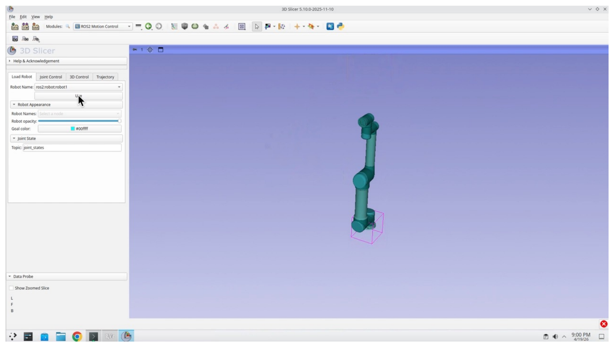

---

## Part 5: Add Patient Models and a Custom End-Effector

### Step 17: Clone the Tutorial Repository

Open a new Konsole terminal and clone the tutorial repository, which contains the spine model, custom end-effector geometry, and supporting data files:

```bash
cd ../home/user
git clone https://github.com/LauraConnolly/slicerros2_tutorial.git
```

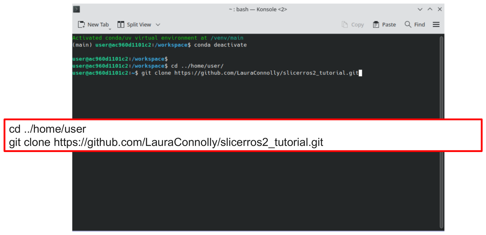

### Step 18: Open the Add Data Dialog

Back in Slicer, click the **Add Data** button in the toolbar (the icon at the top-left of the main toolbar).

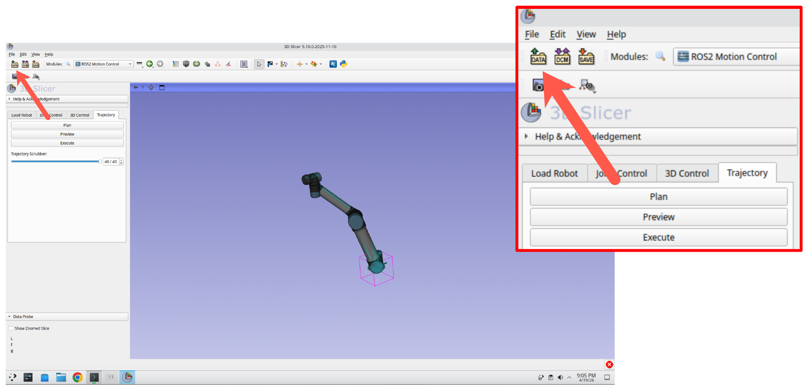

### Step 19: Choose Files to Add

In the Add Data dialog, click **Choose File(s) to Add**.

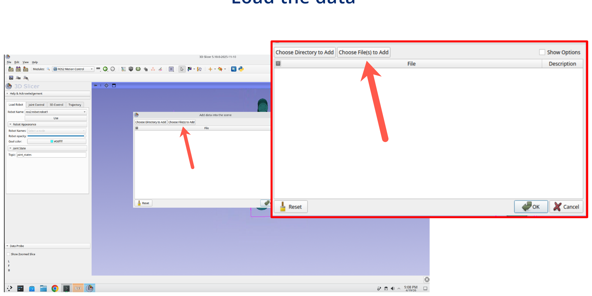

### Step 20: Select the Spine and End-Effector Bundle

Navigate to `/home/user/slicerros2_tutorial/data/` and select **Spine_and_EE.mrb**. Confirm the selection and click **OK**.

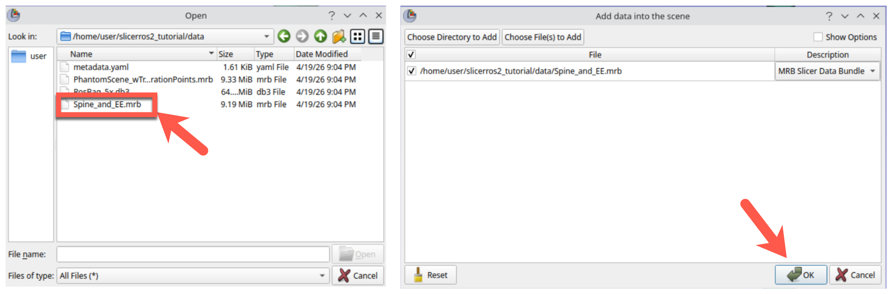

### Step 21: Confirm the Data Loads

After the bundle loads, the 3D view shows the UR5 robot together with the spine model and custom end-effector geometry near its base.

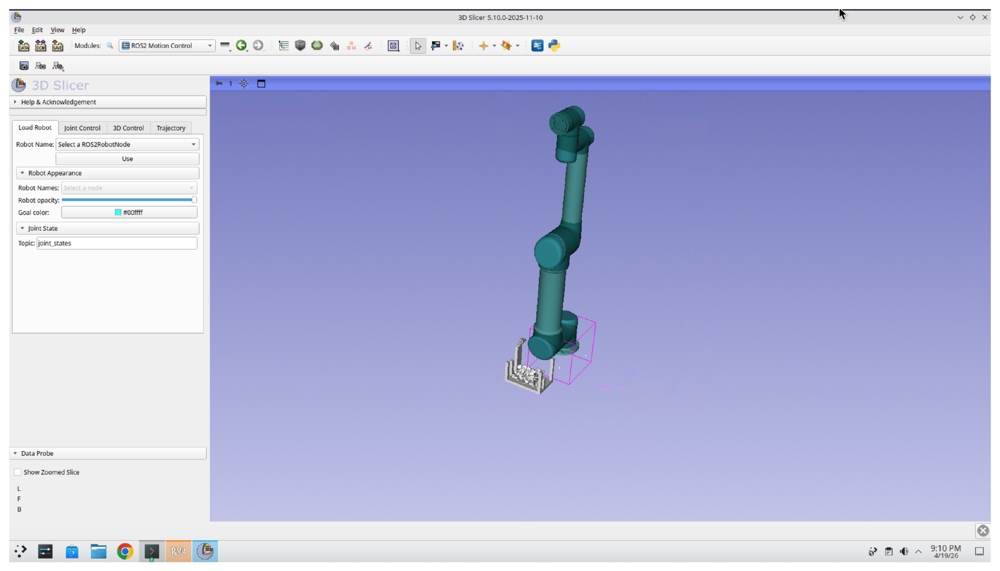

---

## Part 6: Attach the End-Effector to the Robot Transform Tree

### Step 22: Open the Data Module

Press **Ctrl+F** again and search for the **Data** module. Select **Data** from the results and click **OK**.

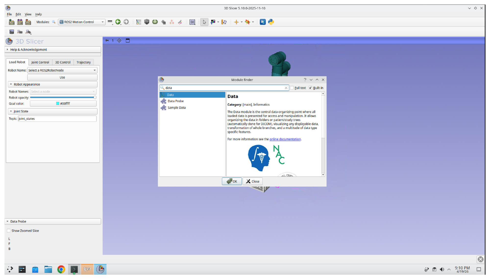

### Step 23: Switch to the Transform Hierarchy Tab

In the Data module, click the **Transform hierarchy** tab to expose the scene's transform tree. This view lets you reparent models under specific robot links so they move with the robot.

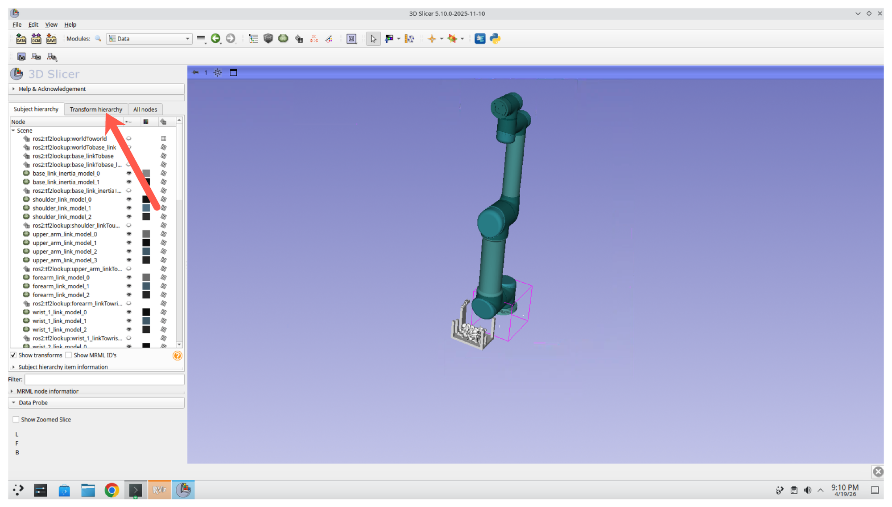

### Step 24: Drag Each Model onto Its Target Transform

Expand the robot transform tree and drag each loaded end-effector model onto the corresponding goal transform:
- ur5_stylus → `ros2:tf2_lookup:wrist_3_linkToFlange`
- ur5_stylus_goal → `tool0_goal_transform`

Once the models are reparented, they follow the robot as its pose updates. Note that in practice these should be added through the urdf file, this is a quick workaround for the purpose of this tutorial.

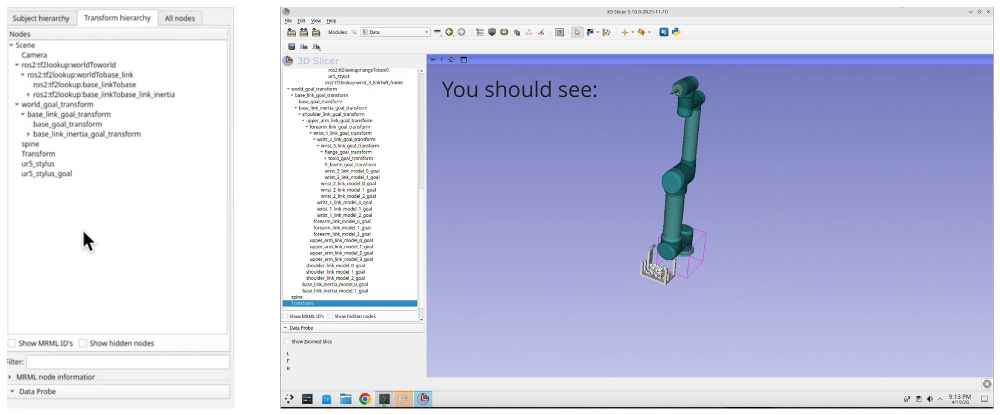

### Step 25: Return to the ROS2 Motion Control Module

Click the **recent modules** button (the small dropdown arrow next to the module navigation buttons in the toolbar) and select **ROS2 Motion Control** to switch back without re-searching.

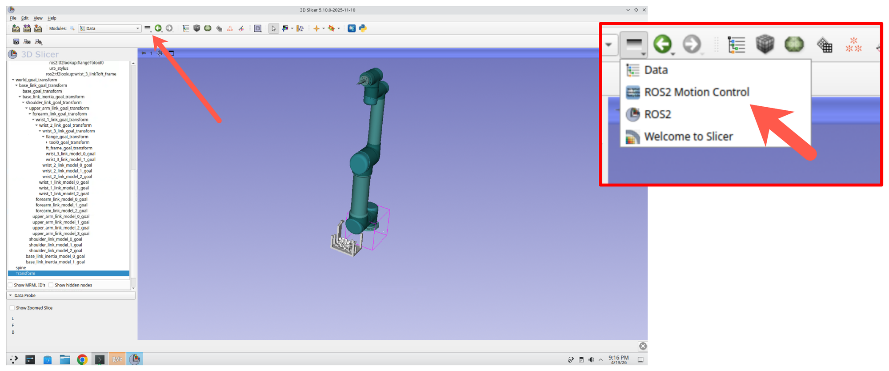

---

## Part 7: Plan Motion Around the Patient Models

### Step 26: Plan a Trajectory to the Spine

With the end-effector attached and the spine in the scene, you can now plan a trajectory that touches key points on the spine model. Use the **3D Control** tab of the Motion Control panel and the interactive goal marker in the 3D view to position the target, then trigger planning.

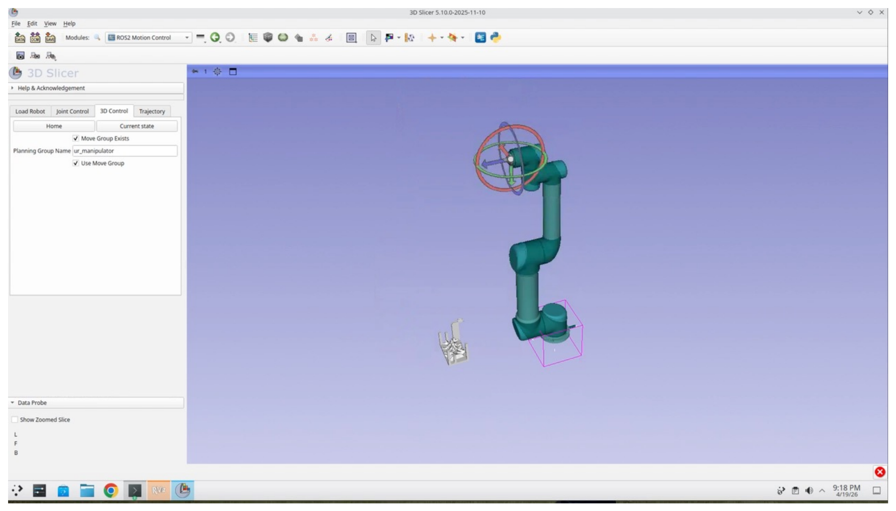

---

# Summary

In this session, you:
- Launched a simulated UR5 with the UR robot driver and MoveIt using mock hardware
- Switched the MoveIt planner to CHOMP from the Context tab
- Connected 3D Slicer to ROS 2 through the SlicerROS2 module and loaded the robot description
- Bound the robot to the ROS2 Motion Control module for interactive control
- Added a spine anatomical model and custom end-effector to the Slicer scene
- Used the module to plan robot motions relative to the anatomical model

<div class="tutorial-nav"><a href="index.html" class="btn-secondary">Back to Workshop Page</a></div>
