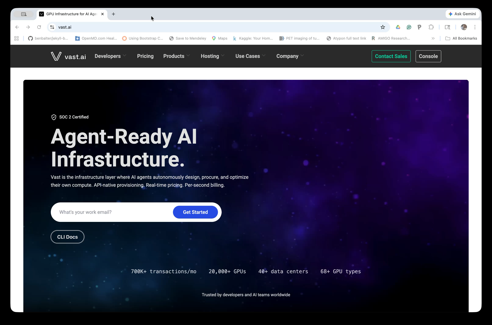
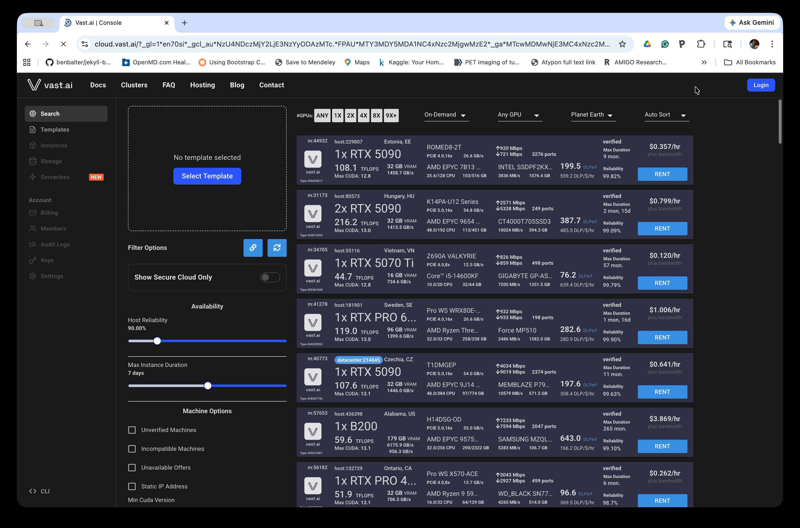
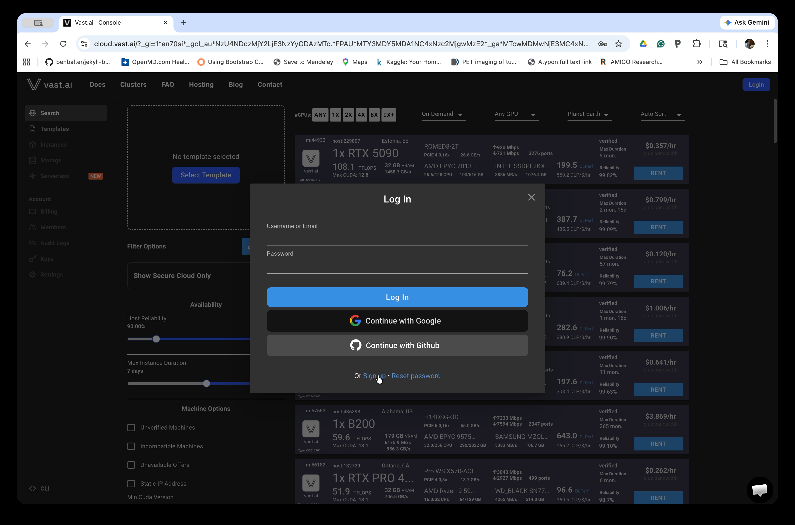
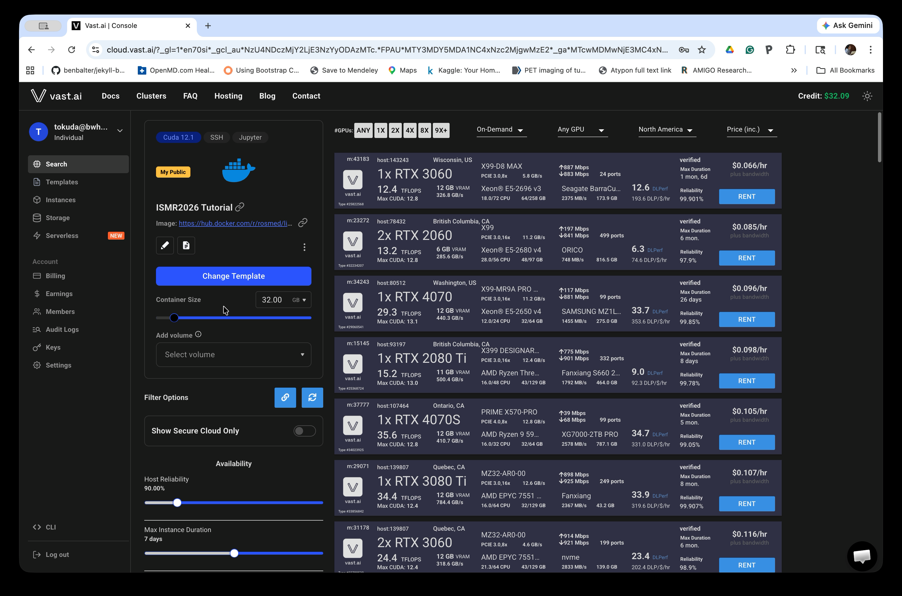
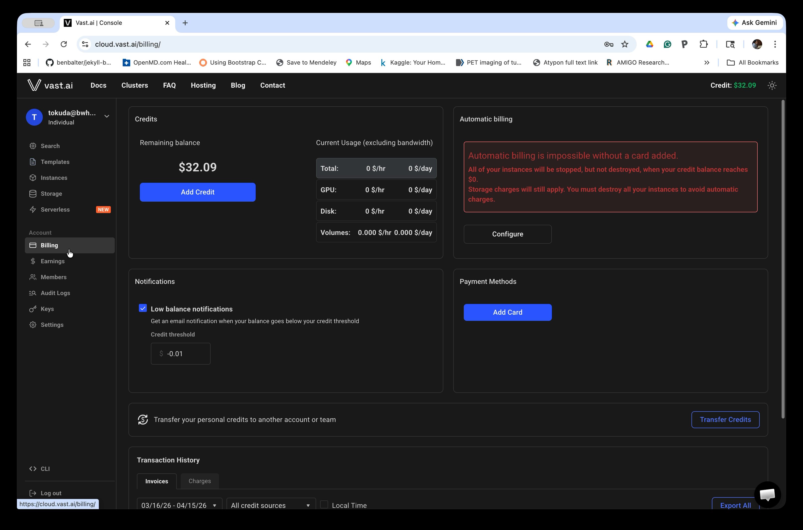

# Prerequisites

Before starting this tutorial, please ensure you have the following prerequisites in place. This will help you successfully complete the SmartTemplate robot-assisted prostate biopsy tutorial.

## Knowledge Prerequisites

This tutorial assumes basic familiarity with:
- ROS2 concepts (nodes, topics, tf2)
- 3D Slicer interface
- Basic understanding of medical image-guided interventions

If you're new to these concepts, we recommend reviewing the following resources before starting:
- [ROS2 Tutorials](https://docs.ros.org/en/jazzy/Tutorials.html)
- [3D Slicer Documentation](https://slicer.readthedocs.io/en/latest/user_guide/getting_started.html)
- [SlicerROS2 Documentation](https://slicer-ros2.readthedocs.io/)

## Computer Environment

You can use either a pre-configured virtual Linux desktop environment available on [vast.ai](https://vast.ai/), or a native Linux machine (Ubuntu 24.04).

### Option 1: Use the virtual Linux desktop environment on the cloud through vast.ai

Vast.ai is a low-cost, public cloud-based marketplace for renting GPUs, often described as an "Airbnb for GPUs." It allows users to rent underutilized GPUs from data centers or private individuals for AI and other computing that require GPUs. Users can launch a new Linux instance with preloaded software packages from a "template."

The Linux desktop environment can be created and used in a browser (e.g., Chrome, Safari). Follow the steps below to set up your vast.ai account before the tutorial.

> **For ISMR2026 Participants:** We will add you to the 'ismr2026' team on vast.ai, which allows us to share virtual Linux environments using the workshop's credit. Please send your e-mail address with the conference organizer (tokuda@bwh.harvard.edu). 

#### Step 1: Go to the vast.ai website

Navigate to [vast.ai](https://vast.ai) and click the **Console** button in the top-right corner.

#### Step 2: Open the Console

The Console shows available GPU machines for rent. You will need to log in (or create an account) before renting a machine. Click the **Login** button in the top-right corner.

#### Step 3: Log in or Sign Up

If you already have an account, enter your credentials. If not, click **Sign Up** at the bottom of the login dialog to create a free account. You can also sign in with Google or GitHub.

#### Step 4: Access the ISMR2026 Tutorial Template

After logging in, open the tutorial template by clicking this link: [ISMR2026 Tutorial Template v2](https://cloud.vast.ai?ref_id=440803&template_id=957841858d260f6ed9dbdf35e7d74217).
 The left panel of the Console will show the **ISMR2026 Tutorial** template selected, and the main panel will list available GPU machines you can rent.

#### Step 5: Add Credits to Your Account

You must add credits before renting a machine. In the left sidebar, click **Billing**, then click **Add Credit** to add funds to your account. A few dollars is typically sufficient for the tutorial duration.

Once your account is funded, you are ready to launch an instance. See [Launching a Container on Vast.ai](container.html) for detailed instructions on renting a machine and starting the desktop environment.

### Option 2: Native Linux Machine

 Hardware Requirements

- A computer with at least 16GB RAM and 20GB free disk space
- When using Docker, ensure your system meets Docker requirements and has adequate resources allocated to Docker

#### Software
If you prefer to install the components manually on Ubuntu 24.04, you'll need:

1. **ROS2 Jazzy** - The Robot Operating System (ROS)
2. **3D Slicer (v5.10.0)** - Medical image visualization and processing platform
3. **SlicerROS2 Module** - Integration between 3D Slicer and ROS2
4. **Additional modules** - For specialized functionality like Z-frame registration
5. **SmartTemplate Demo Repository** - The robot description and control code

Detailed installation instructions for all required software can be found in the [Setup](setup.html) page.

[⬅️ Back to ISMR 2025 Workshop Page](index.html)
